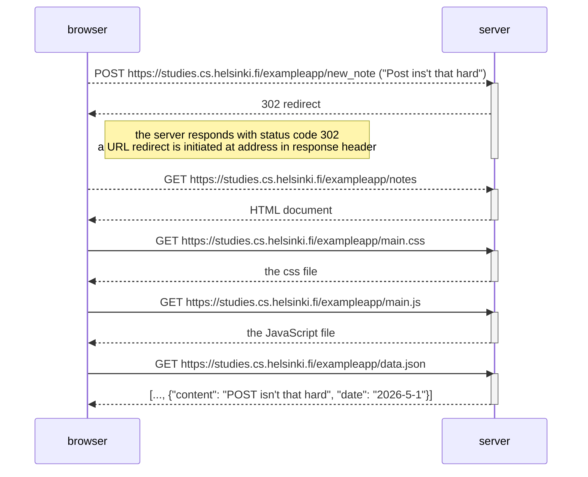
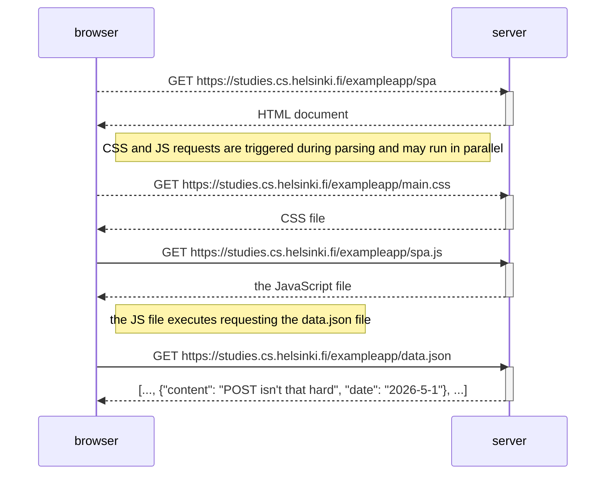
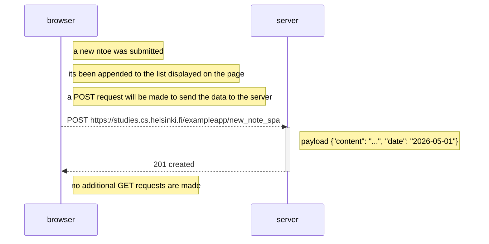

0.4  

```mermaid
sequenceDiagram
    participant browser
    participant server

    browser-->>server: POST https://studies.cs.helsinki.fi/exampleapp/new_note ("Post ins't that hard")
    activate server
    server-->>browser: 302 redirect
    
 Note right of browser: the server responds with status code 302 <br/> a URL redirect is initiated at address in response header

    deactivate server

    browser-->>server: GET https://studies.cs.helsinki.fi/exampleapp/notes
    activate server
    server-->>browser: HTML document
    deactivate server

    browser->>server: GET https://studies.cs.helsinki.fi/exampleapp/main.css
    activate server
    server-->>browser: the css file
    deactivate server

    browser->>server: GET https://studies.cs.helsinki.fi/exampleapp/main.js
    activate server
    server-->>browser: the JavaScript file
    deactivate server

    browser->>server: GET https://studies.cs.helsinki.fi/exampleapp/data.json
    activate server
    server-->>browser: [..., {"content": "POST isn't that hard", "date": "2026-5-1"}]
    deactivate server
```

0.5  

```mermaid
sequenceDiagram
    participant browser
    participant server

    browser-->>server: GET https://studies.cs.helsinki.fi/exampleapp/spa
    activate server
    server-->>browser: HTML document
    deactivate server

Note right of browser: CSS and JS requests are triggered during parsing and may run in parallel

    browser-->>server: GET https://studies.cs.helsinki.fi/exampleapp/main.css
    activate server
    server-->>browser: CSS file
    deactivate server
    
    browser->>server: GET https://studies.cs.helsinki.fi/exampleapp/spa.js
    activate server
    server-->>browser: the JavaScript file
    deactivate server

Note right of browser: the JS file executes requesting the data.json file

    browser->>server: GET https://studies.cs.helsinki.fi/exampleapp/data.json
    activate server
    server-->>browser: [..., {"content": "POST isn't that hard", "date": "2026-5-1"}, ...]
    deactivate server
```

0.6  

```mermaid
sequenceDiagram
    participant browser
    participant server

Note right of browser: a new ntoe was submitted
Note right of browser: its been appended to the list displayed on the page
Note right of browser: a POST request will be made to send the data to the server

    browser-->>server: POST https://studies.cs.helsinki.fi/exampleapp/new_note_spa
    activate server

Note right of server: payload {"content": "...", "date": "2026-05-01"}

    server-->>browser: 201 created
    deactivate server

note right of browser: no additional GET requests are made
```
