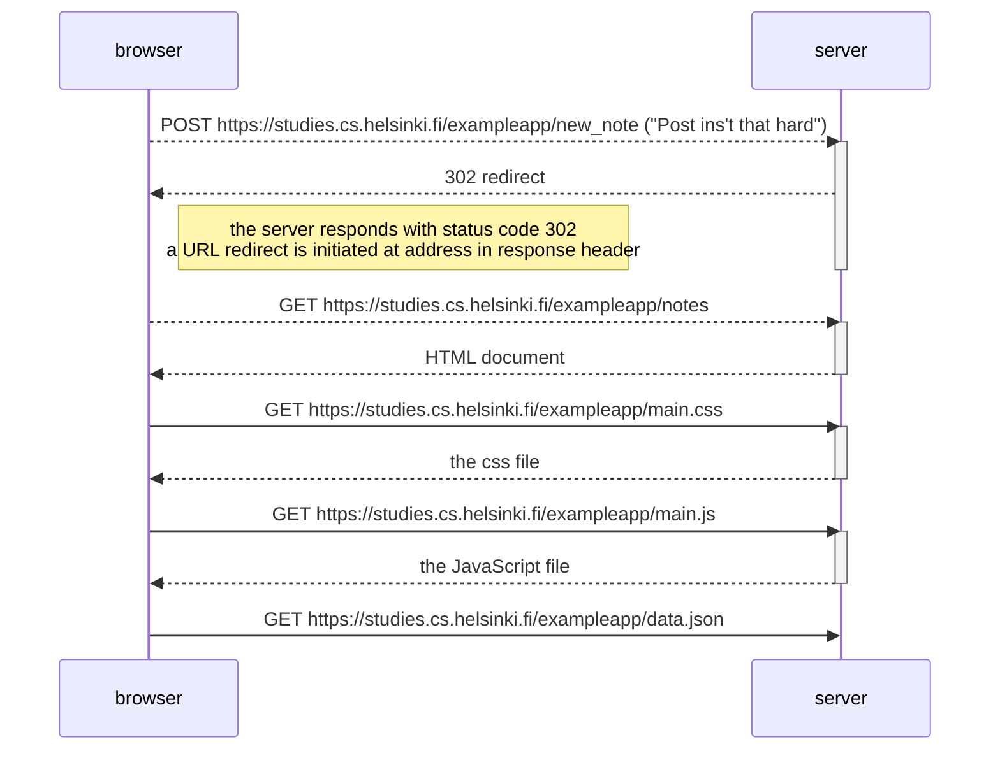

```mermaid
sequenceDiagram
    participant browser
    participant server

    browser-->>server: POST https://studies.cs.helsinki.fi/exampleapp/new_note ("Post ins't that hard")
    activate server
    server-->>browser: 302 redirect
    
 Note right of browser: the server responds with status code 302 <br/> a URL redirect is initiated at address in response header

    deactivate server

    browser-->>server: GET https://studies.cs.helsinki.fi/exampleapp/notes
    activate server
    server-->>browser: HTML document
    deactivate server

    browser->>server: GET https://studies.cs.helsinki.fi/exampleapp/main.css
    activate server
    server-->>browser: the css file
    deactivate server

    browser->>server: GET https://studies.cs.helsinki.fi/exampleapp/main.js
    activate server
    server-->>browser: the JavaScript file
    deactivate server

    browser->>server: GET https://studies.cs.helsinki.fi/exampleapp/data.json
```
    activate server
    server-->>browser: [..., {"content": "POST isn't that hard", "date": "2026-5-1"}]
    deactivate server
