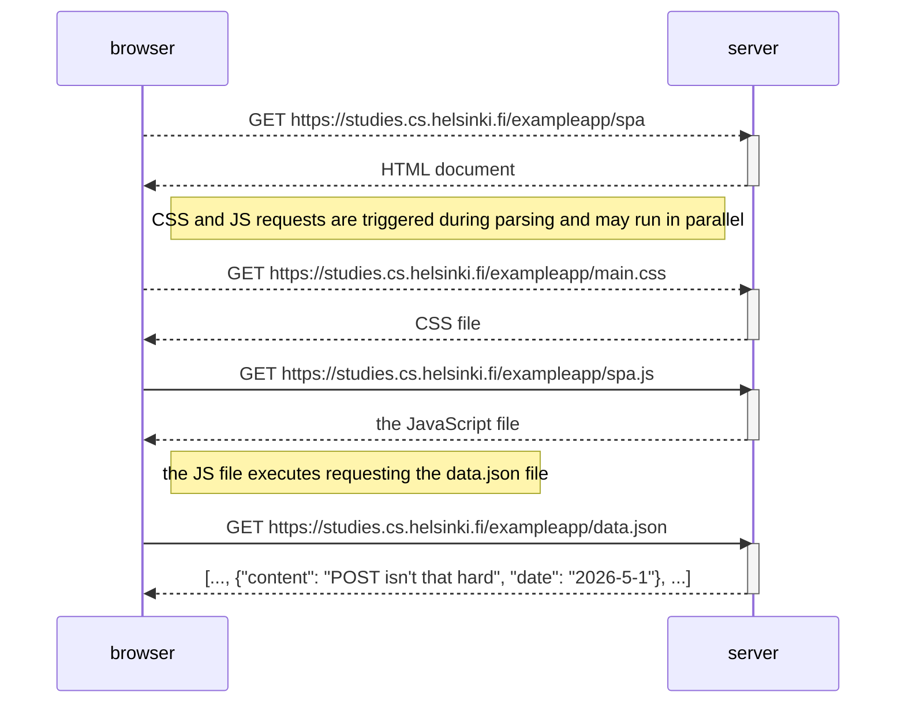

```mermaid
sequenceDiagram
    participant browser
    participant server

    browser-->>server: GET https://studies.cs.helsinki.fi/exampleapp/spa
    activate server
    server-->>browser: HTML document
    deactivate server

Note right of browser: CSS and JS requests are triggered during parsing and may run in parallel

    browser-->>server: GET https://studies.cs.helsinki.fi/exampleapp/main.css
    activate server
    server-->>browser: CSS file
    deactivate server
    
    browser->>server: GET https://studies.cs.helsinki.fi/exampleapp/spa.js
    activate server
    server-->>browser: the JavaScript file
    deactivate server

Note right of browser: the JS file executes requesting the data.json file

    browser->>server: GET https://studies.cs.helsinki.fi/exampleapp/data.json
    activate server
    server-->>browser: [..., {"content": "POST isn't that hard", "date": "2026-5-1"}, ...]
    deactivate server
```
