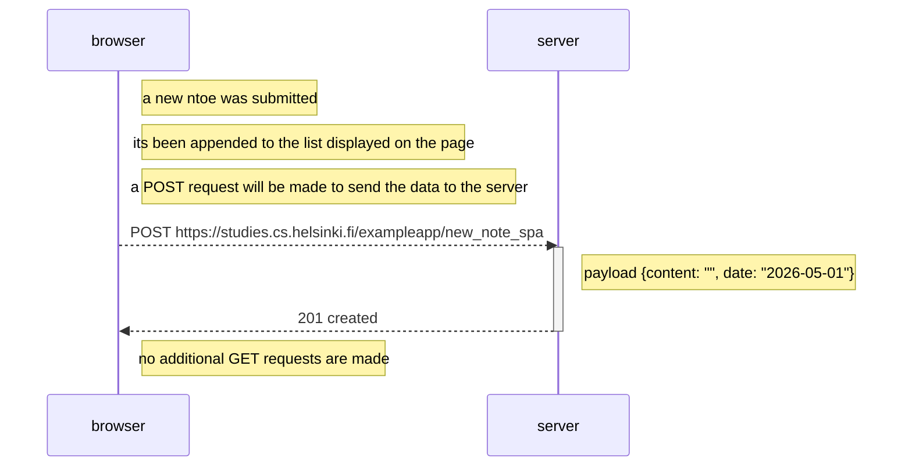

```mermaid
sequenceDiagram
    participant browser
    participant server

Note right of browser: a new ntoe was submitted
note right of browser: its been appended to the list displayed on the page
note right of browser: a POST request will be made to send the data to the server

    browser-->>server: POST https://studies.cs.helsinki.fi/exampleapp/new_note_spa
    activate server

Note right of server: payload {content: "", date: "2026-05-01"}

    server-->>browser: 201 created
    deactivate server

note right of browser: no additional GET requests are made
```
